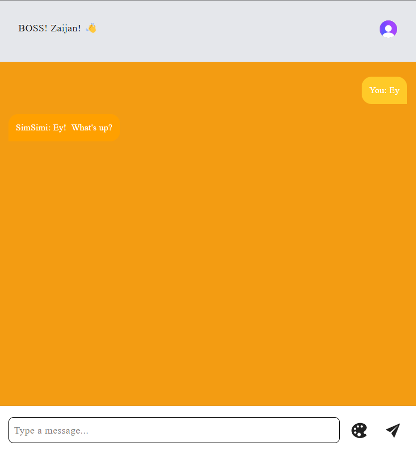

# ChatBot Application

This is a chatbot application built with React & Python, using Clerk for authentication, Zustand for state management, and a backend API for responses.

## Features
- User authentication with Clerk
- Persistent theme customization with Zustand
- Real-time chat experience with a chatbot API (gemini)
- Scroll-to-bottom functionality for seamless message viewing
- Responsive design for mobile and desktop views

## Tech Stack
- **Frontend:** React.js, Vite, Tailwind CSS, Framer Motion
- **State Management:** Zustand
- **Authentication:** Clerk
- **Backend API:** Python-based chatbot API

## Installation

1. Clone the repository:
   ```sh
   git clone https://github.com/your-repo/react-python-chatbot.git
   cd react-python
   ```

2. Install dependencies:
   ```sh
   npm install
   ```

3. Set up environment variables:
   Create a `.env` file and add your Clerk API keys and backend URL:
   ```sh
   REACT_APP_CLERK_FRONTEND_API=your_clerk_api_key
   REACT_APP_CHATBOT_API=https://your-backend-api.com/chat
   ```

4. Start the development server:
   ```sh
   npm run dev
   ```

## Usage
1. Sign in using Clerk authentication.
2. Start a conversation by typing a message in the input box and pressing Enter or clicking the send button.
3. The chatbot will respond using the backend API.
4. Change the theme using the theme picker component.

## Deployment
This project can be deployed on **Vercel**:
```sh
npm run build
vercel deploy
```

## React + Vite
This template provides a minimal setup to get React working in Vite with HMR and some ESLint rules.

Currently, two official plugins are available:

- [@vitejs/plugin-react](https://github.com/vitejs/vite-plugin-react/blob/main/packages/plugin-react/README.md) uses [Babel](https://babeljs.io/) for Fast Refresh
- [@vitejs/plugin-react-swc](https://github.com/vitejs/vite-plugin-react-swc) uses [SWC](https://swc.rs/) for Fast Refresh



